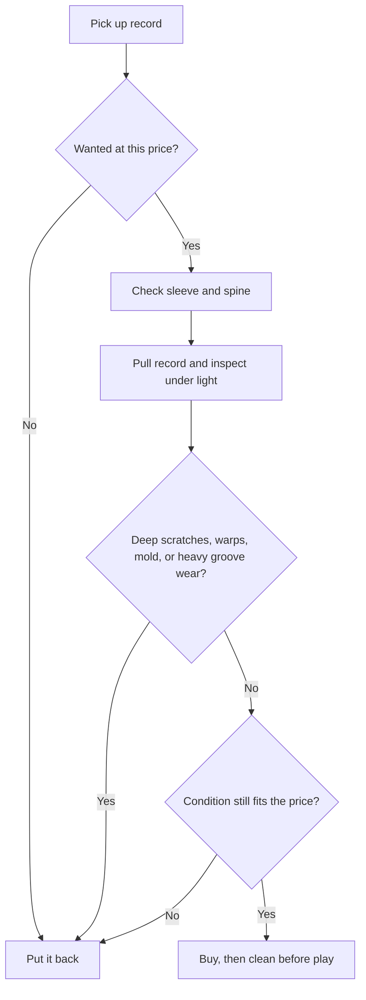

# Collecting Guide

These are practical collecting defaults. Record value, rarity, and what counts as a "good buy" vary wildly depending on the genre and how picky you are about condition.

## What Matters Early

- **Buy records you actually want to replay**, not just records that seem like "good collector items."
- **Learn the Goldmine Grading Standard** before buying used.
- For most beginners, **VG+** is the safest used target.
- Treat sleeve condition and vinyl condition as completely separate things.

## Quick Grading Basics (Goldmine Standard)

- **NM (Near Mint):** Nearly perfect; use this grade mentally as rare, not normal.
- **VG+ (Very Good Plus):** Played and handled carefully. Minor cosmetic signs (light scuffs) are normal, but it should sound fantastic.
- **VG (Very Good):** Playable, but expect visible wear and some audible surface noise (crackles in quiet parts).
- **G / G+ (Good):** A terrible name for a grade. "Good" means heavily worn. Buy only if the record is cheap, incredibly rare, or sentimental.

## Used-Bin Inspection Flow

## What To Look For In Person

- **Check for warps:** Hold the record at eye level to see if it resembles a bowl. Warps are much worse than tiny sleeve wear.
- **Feel for scratches:** If you can feel a scratch with your fingernail, you will definitely hear a loud "POP" every time the needle hits it.
- **Spindle marks:** Look at the label around the center hole. Lots of "spider marks" mean the previous owner struggled to put the record on the platter, indicating heavy, careless use.
- **Confirm the matrix:** Make sure the actual record inside the sleeve matches what you think you are buying.

## Online Buying Habits (Discogs)

Discogs is the world's largest marketplace for records, but you must navigate it carefully.

- **Beware of Over-Grading:** Many amateur sellers grade their records visually, not by playing them. A record that looks VG+ might sound VG if it has deep-seated groove wear.
- **Read the seller comments:** Never buy a record based solely on the assigned grade. Prefer sellers who write specific descriptions (e.g., "Plays great, minor crackle in track 2").
- **Check the [Steve Hoffman Forums](../explore/community-resources.md):** If you are about to spend $100 on a specific vintage pressing, search the forums first to ensure that specific pressing actually sounds good. Some original pressings are notoriously bad.
- **Catalog Your Collection:** Download the Discogs app to scan barcodes and keep track of your collection. It helps you avoid buying duplicates and gives you a rough estimate of your collection's value.

## Crate Digging Culture

Crate digging is half the fun of the hobby. To see what real crate digging looks like, check out **[Noble Records on YouTube](https://www.youtube.com/c/NobleRecords)**. Dillon provides incredible insights into identifying rare pressings, evaluating condition in the wild, and the day-to-day life of running an independent record store.

## After You Buy

- **Clean used records before first play:** See our [Deep Cleaning Guide](../maintenance/deep-cleaning.md).
- **Replace bad inner sleeves:** Swap abrasive paper sleeves for anti-static poly-lined sleeves.
- **Store records vertically:** Never stack records flat on top of each other; the weight will warp them and cause ring-wear on the jackets.