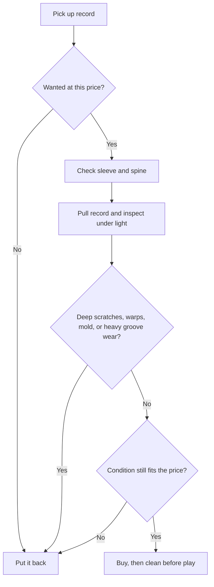

# Collecting Guide

These are practical collecting defaults, not strict rules. Record value, rarity, and what counts as a "good buy" can vary a lot by genre, market, and how picky you are about condition.

## What Matters Early

- Buy records you actually want to replay, not just records that seem like "good collector items."
- Learn the basic condition gap between `NM`, `VG+`, `VG`, and `G` before buying used.
- For most beginners, `VG+` is the safest used target.
- Treat sleeve condition and vinyl condition as separate things.

## Used-Bin Inspection Flow

## Quick Grading Basics

- `NM`: nearly perfect; use this grade mentally as rare, not normal.
- `VG+`: played and handled carefully; minor cosmetic signs are normal.
- `VG`: playable, but expect visible wear and some audible surface noise.
- `G` or `G+`: buy only if the record is cheap, rare, or sentimental enough to justify obvious flaws.

Practical default:

- For casual listening copies, aim for `VG+` or better.
- For hard-to-find originals, you may decide `VG` is acceptable.
- For common titles, patience usually beats settling.

## What To Look For In Person

- Check for warps before worrying about tiny sleeve wear.
- Look for deep scratches you can feel or clearly see under light.
- Watch for cloudy grime, mold, or signs the record was stored badly.
- Check the spindle area and labels for signs of heavy handling.
- Confirm the right record is actually inside the sleeve.

## Good Used-Bin Habits

- Keep a short want-list on your phone.
- Know your ceiling price for common titles before digging.
- Compare pressing details, not just album titles.
- If a store grades aggressively, buy more cautiously there.
- When in doubt, leave it and keep looking.

## Online Buying Habits

- Read seller comments, not just the grade.
- Prefer sellers who explain playback issues clearly.
- Cross-check the exact release, catalog number, and format.
- For expensive copies, ask about play grading, warps, seam splits, and inserts.

## After You Buy

- Clean used records before first play.
- Replace bad inner sleeves with anti-static or poly-lined sleeves.
- Store records vertically.
- Do not leave records stacked flat or sitting on the turntable for long periods.

## Sources

- [How To Grade Items](https://support.discogs.com/hc/en-us/articles/360001566193)
- [How to Store Vinyl Records Properly: Sleeves, Shelves, and Climate Tips](https://www.discogs.com/digs/collecting/how-to-store-vinyl-records/)
- [How to Clean Vinyl Records](https://www.nytimes.com/wirecutter/guides/how-to-clean-vinyl-records/)
- [Our Favorite Ways to Protect and Show Off Your Vinyl Records](https://www.nytimes.com/wirecutter/reviews/how-to-display-protect-vinyl-records/)
- [A Collector’s Guide to Global Vinyl Hunting](https://www.discogs.com/digs/collecting/a-collectors-guide-to-global-vinyl-hunting/)