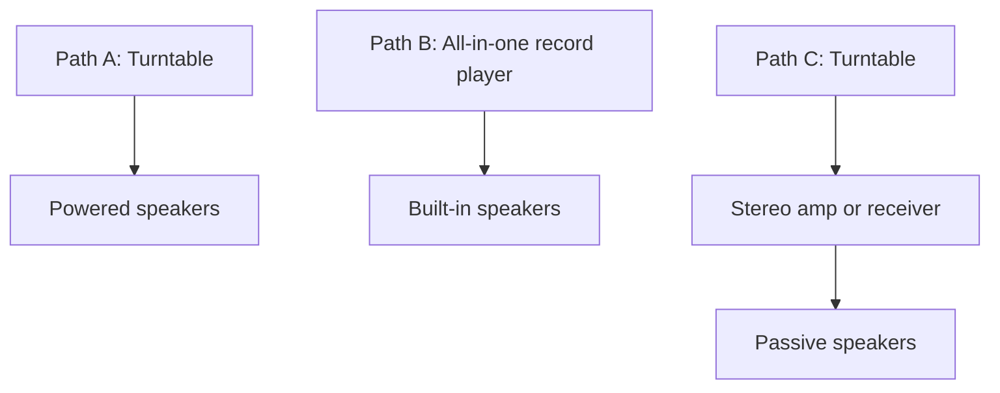

# Setup Paths

Prices below are rough April 2026 reference points and may vary by sale timing, retailer, and local used-market availability.

## Signal Chain Snapshot

## Path A: Practical Default For The Current Budget

`Turntable + powered speakers`

- Why: simplest wiring, cleanest look, easiest to place, and usually the strongest value around `$400-$550`.
- Style fit: easiest path to a light wood or walnut look without a bulky black receiver.
- Budget shape: roughly half the money into the turntable, half into speakers.

Good example of the turntable side:

- U-Turn Orbit Basic at about `$249`.
- Add the built-in phono preamp if your speakers do not have phono input.
- Good if you are fine with manual operation and a less feature-heavy experience.

Speaker note:

- Powered speakers are the right default here.
- If you want to stay firmly under `$500`, watch for sale, open-box, or used pairs from reputable brands.
- If you want TV or phone convenience, favor speakers with line input plus Bluetooth.

## Path B: Easiest And Cheapest Start

`All-in-one record player`

- Why: least friction, least wiring, lowest initial spend.
- Tradeoff: lower long-term ceiling and weaker stereo separation than a separate-speaker setup.
- Good if you are still testing whether the hobby will stick.

Research-backed example:

- Angels Horn H019 at about `$240`.
- Better than typical suitcase-style players, but still a starter convenience option rather than the best long-term system.

## Path C: The Future Upgrade Path

`Turntable + stereo amp/receiver + passive speakers`

- Why: most flexible and most “classic hi-fi” visually.
- Tradeoff: harder to keep under the current budget when bought new.
- Best use now: only if you find a local used deal on speakers or an amp.

Research-backed examples of the future pieces:

- Sony STR-DH190 for a beginner-friendly stereo receiver with phono input.
- Sony SS-CS5M2 as an affordable passive speaker option.
- Fluance RT85N or Rekkord F300 as future turntable upgrades once the budget is higher.

## My Practical Recommendation

For this room and budget, start with Path A.

- It keeps the system visually light.
- It avoids overspending before you know how much you care about the hobby.
- It leaves a clean upgrade path: speakers first, then cartridge or stylus, then phono stage later if the rest of the system earns it.

## Sources

- [The Best Record Player Setup for Beginners](https://www.nytimes.com/wirecutter/lists/the-best-record-player-setup-for-beginners/)
- [The Best Turntables and Record Players](https://www.nytimes.com/wirecutter/reviews/best-turntable/)
- [Outgrown Your Starter Record Player? Here's How to Shop for a Quality Turntable](https://www.nytimes.com/wirecutter/reviews/how-to-shop-for-a-turntable/)
- [How to choose the right turntable](https://www.crutchfield.com/learn/turntable-buying-guide.html)
- [How to connect a turntable](https://www.crutchfield.com/learn/how-to-connect-a-turntable.html)