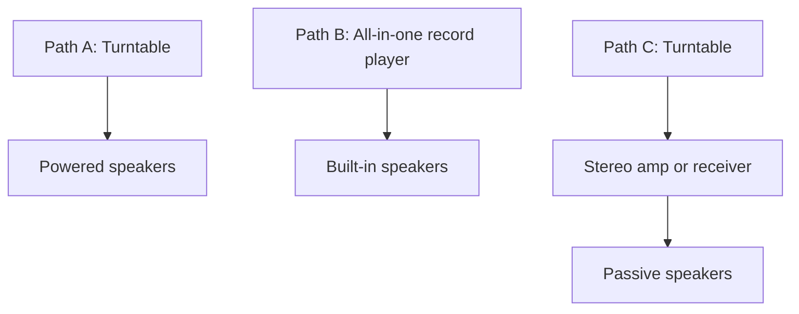

# Setup Paths & Best Practices

Setting up a turntable correctly is just as important as buying the right one. A $1,000 turntable set up poorly will sound worse than a $200 turntable set up perfectly.

Prices below are rough reference points and may vary by sale timing and used-market availability.

## The Most Common Setup Mistake: Speaker Placement

Before looking at the paths below, remember this golden rule: **Do not put your speakers on the same surface as your turntable.** 

Turntables are essentially vibration-measuring machines. If your speakers are on the same table, the bass vibrations will travel through the table, up the turntable's feet, through the stylus, and back out the speakers. This creates a feedback loop that sounds "muddy" at low volumes and can physically damage your speakers at high volumes.

- **The ideal setup:** Speakers on dedicated speaker stands, forming an equilateral triangle with your listening position. Tweeters should be at ear level.
- **The compromise:** If speakers must be on the same surface, place them on high-density isolation pads to decouple them from the table.

## Signal Chain Snapshot

## Path A: Practical Default For The Current Budget

`Turntable + powered speakers`

- **Why:** Simplest wiring, cleanest look, easiest to place, and usually the strongest value around `$400-$550`.
- **Style fit:** Easiest path to a minimalist look without a bulky black receiver.
- **Budget shape:** Roughly half the money into the turntable, half into speakers.

## Path B: Easiest And Cheapest Start

`All-in-one record player`

- **Why:** Least friction, least wiring, lowest initial spend.
- **Tradeoff:** Lower long-term ceiling, very poor stereo separation, and cheap components can be hard on your records.
- **Good if:** You are still testing whether the hobby will stick and just want background music.

## Path C: The Future Upgrade Path

`Turntable + stereo amp/receiver + passive speakers`

- **Why:** Most flexible and most “classic hi-fi” visually. If a speaker blows, you only replace the speaker.
- **Tradeoff:** Takes up much more physical space and usually costs more if buying everything new.
- **Best use now:** If you find a great local used deal on a stereo receiver or passive speakers.

## Visual Setup Guides

Setting up a turntable is a visual process. Reading about "tracking force" is confusing; watching someone do it takes 30 seconds.

- **[Fluance: How to Balance a Tonearm & Set Tracking Force](https://www.youtube.com/watch?v=WM-aIDwfrhc)**
  Even if you don't own a Fluance, this is the clearest, most concise video on the internet demonstrating how to properly set up the counterweight on *any* turntable.

- **[Crutchfield: How to Connect a Turntable](https://www.crutchfield.com/learn/how-to-connect-a-turntable.html)**
  Look at the wiring diagrams in this guide before you start plugging RCA cables in. It perfectly illustrates when you need to switch your phono preamp ON versus OFF depending on your amp.

- **[Turntable Lab: Cartridge Alignment Guide](https://www.turntablelab.com/pages/how-to-install-a-phono-cartridge)**
  If you decide to upgrade your cartridge later, this visual guide walks you through using a protractor to ensure the needle tracks perfectly straight.

## What's Next?
If you've set everything up and something sounds wrong, check the **[Troubleshooting Guide](troubleshooting.md)**. If you are looking to buy gear for Path A or C, check our **[Buying Reading List](../buying/reading-list.md)**.